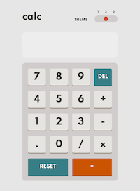
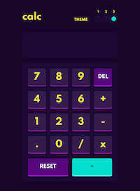

# Calculator

## Table of contents

- [Overview](#overview)
  - [Live Preview](#Live-preview)
  - [Screenshot](#screenshot)
- [My process](#my-process)
  - [Built with](#built-with)
  - [What I learned](#what-i-learned)
  - [Continued development](#continued-development)
  - [Acknowledgements](#acknowledgements)

## Overview

### Live preview

[Click Here](https://bhornbhaya.github.io/odin-calculator/)

### Screenshot

### Desktop Version

### Mobile Version

## My process

### Built with

- HTML5
- CSS
- Javascript
- Sass
- CSS Grid
- Flexbox

### What I learned

- DOM and DOM Manipulation
- Selecting and manipulating elements
- Handling click events
- Manipulating CSS styles
- How to use ES6 classes to organize code
- How to sync JavaScript code with UI
- How to make toggle switches
- How to implement light mode and purple mode

### Continued development

- Save user's preference theme
- Limit digits on screen
- Enable number keys for user to type

### Acknowledgements

I combined two challenges from two websites into one project. The user interface is a challenge by [Frontend Mentor](https://www.frontendmentor.io/challenges/calculator-app-9lteq5N29) and the calculation part is a challenge by [The Odin Project](https://www.theodinproject.com)

Coded by [me](https://www.linkedin.com/in/bhornbhaya/)
